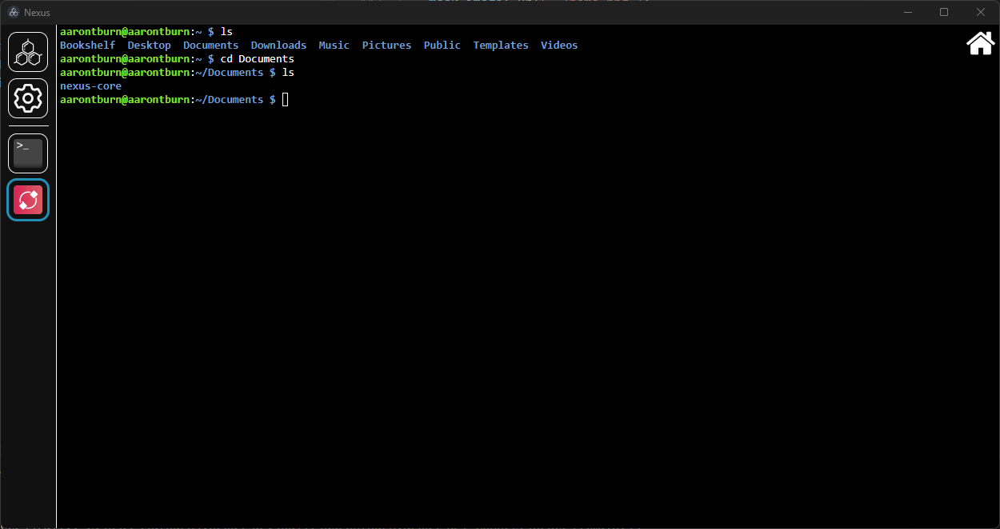
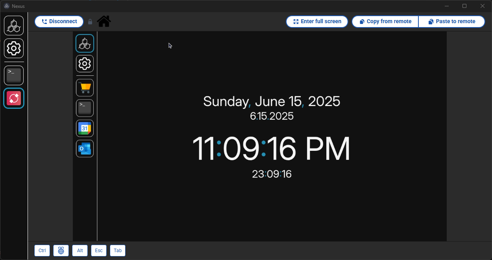

# Nexus - Raspberry Pi Connect

Remotely connect to your Raspberry Pi to screenshare or access the remote shell within Nexus.

Example: Accessing the remote shell.  

Example: Screen-sharing (Nexus within Nexus!)   

## Installation
You will need to setup [Raspberry Pi Connect](https://www.raspberrypi.com/documentation/services/connect.html) on your Raspberry Pi.

1. Press the "Install to Nexus" button for easy installation directly to your Nexus client.
   
or

1. Download the latest release `.zip`. 
2. In Nexus, navigate to **Settings** > **Import Module**.
3. Select the downloaded `.zip` file to install.

## Privacy
This module collects no user information and stores only session cookies. 